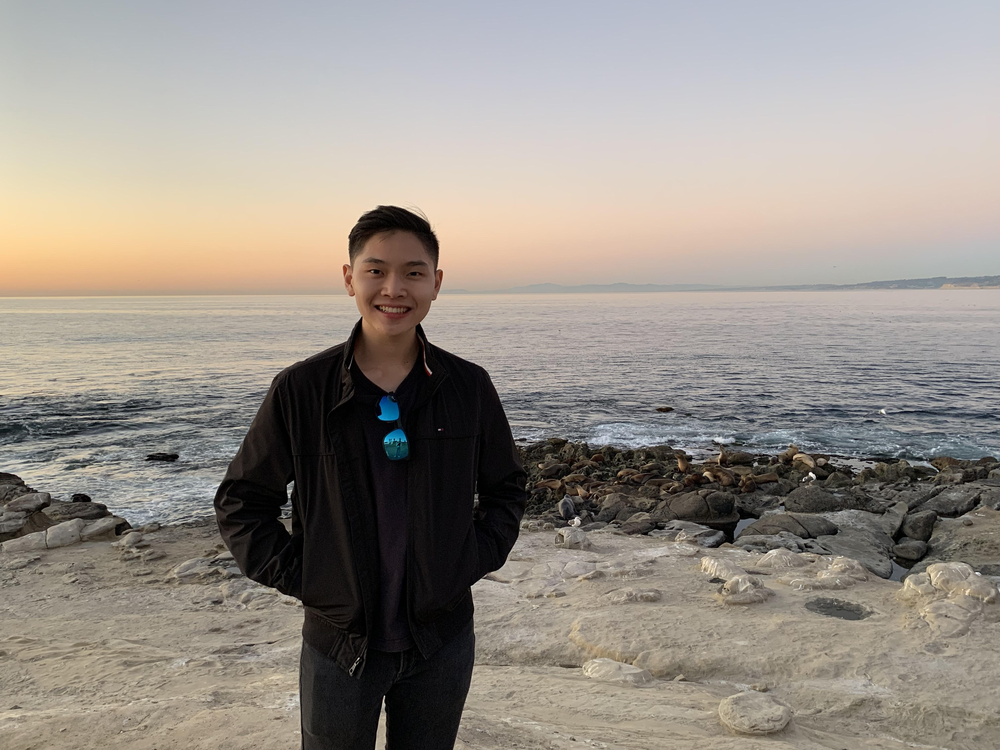

# Melvyn Nam Qiang Tan
## About Me
Hi there, my name is Melvyn and I am from Malaysia. I have lived there for over 20 years and have recently come to the US for studies.
I am a Junior studying Mathematics - Computer Science at UCSD and I have been enjoying it very much so far!

As you've read from the above, I am Malaysian! Malaysia is located in South-East Asia and is about 18 hours away by plane from San Diego. Malaysia is known for its rich culture, friendly people as well as amazing food. The weather in Malaysia is extremely predictable - it is always hot and humid all year round. It is normal to see Malaysians going about their day to day business in T-shirts, shorts and flip flops. The image shown is the Petronas Twin Towers and is located in the heart of Kuala Lumpur. It was the tallest building in the world from 1998 to 2004. 

## Hobbies
### Video Games
In my free time, I enjoy playing video games with my friends. I really enjoy playing team based games such as Dota 2, CSGO, RuneScape, and many other games. Additionally, I also really enjoy playing role-playing games such as Skyrim, Witcher 3 and Elden Ring. I think that Skyrim is by far my favorite role-playing game as there are so many builds and quests to complete that you could spent lots of hours on it and not get bored. The graphics on the game are also excellent and look very realistic. 

Overall, I would rate my top 3 favorite games as
1. Skyrim
2. CSGO
3. Dota 2

### Other
Other than that, I also have other hobbies such as
- Socialising and meeting up with friends
- Watching action movies
- Trying out new foods and cooking